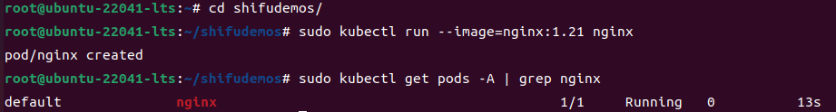

# shifu-helloworld

## Steps

### Step 1: Install Shifu

- **Commands**

```shell
docker ps
curl -sfL https://raw.githubusercontent.com/Edgenesis/shifu/main/test/scripts/shifu-demo-install.sh | sudo sh -
sudo kubectl get pods -A 
```

- **Proof of Work**


### Step 2: Prepare shifudemos

- **Commands**

```shell
cd shifudemos
sudo kubectl run --image=nginx:1.21 nginx
sudo kubectl get pods -A | grep nginx
```

- **Proof of Work**



### Step 3: Build and Push Image

- **Commands**

```shell
docker login
docker build -t shifu-helloworld:latest .
docker tag shifu-helloworld:latest justlorain/shifu-helloworld:latest
docker push justlorain/shifu-helloworld:latest
```
- **Proof of Work**


### Step 4: Apply shifu-helloworld

- **Commands**

```shell
sudo kubectl apply -f run_dir/shifu/demo_device/edgedevice-plate-reader
sudo kubectl get pods -A | grep plate
```

- **Proof of Work**


### Step 5: Check Log

- **Commands** 

```shell
sudo kubectl get pods -A | grep shifu-helloworld
sudo kubectl logs shifu-helloworld-5d9cbb45fc-mwmks
```

- **Proof of Work**


## License

shifu-helloworld is distributed under the [Apache License 2.0](./LICENSE).
